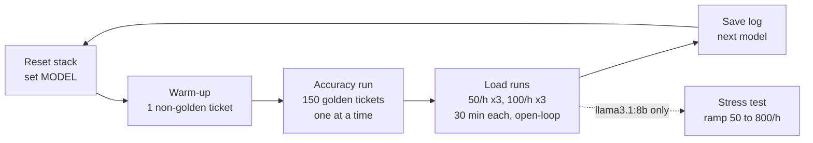

# Test Playbook

Procedure for every test reported in Assignment 1. A tester with this repository, the two machines below and this document can repeat every run without further information.

---

## Slide 8 summary



1. **Reset:** fresh database, empty log, `MODEL` set in `.env`, digests checked against `scripts/models.lock.json`.
2. **Warm-up:** one non-golden ticket loads the model into memory. It is excluded from all results.
3. **Accuracy and single-request latency:** the 150 golden tickets are sent one at a time; overall and per-category accuracy, a confusion matrix, and median/p95 latency with no queueing.
4. **Load:** JMeter open-loop (Open Model Thread Group, random Poisson arrivals). Tickets at 50/h and 100/h, with 214 searches/h and 60 stats/h running alongside. Three 30-minute runs per rate per model.
5. **Stress (one model):** ticket arrival rate ramps from 50/h to 800/h over 60 min to find the highest rate the system can sustain.
6. **Evidence:** each run's `.jtl` and the service log are kept in `results/` and reconciled by run ID.

---

## 1. Test environment

| Role | Machine | Runs |
|---|---|---|
| System under test | Laptop: AMD Ryzen AI 9 HX 370 (12 cores / 24 threads), 32 GB RAM, Windows | Docker Desktop (WSL2 backend): `app`, `ollama`, `postgres` |
| Load generator | Desktop: Intel Core i5-13600KF (14 cores / 20 threads), 32 GB RAM, Windows | Apache JMeter 5.6.3 (non-GUI), Python 3 |
| Network | Both machines wired to the same home router. Laptop: ASUS USB-A Ethernet adapter + Ugreen Cat8 cable, Wi-Fi off. Desktop: built-in Ethernet. Addresses assigned by the router (DHCP) | Link speed: laptop 100 Mbps, desktop 1000 Mbps. `GET /health` round trip from the desktop: 15 ms (new connection, through Docker Desktop's port forwarding) |

The network path adds about 15 ms per request (connection setup, router, Docker port forwarding), against seconds of model inference and the 1 s search requirement, so it does not materially affect the results. The laptop's link runs at 100 Mbps (USB adapter); the largest response, a 20-result search of about 20 KB, takes about 1.6 ms to transfer at that speed, which is negligible against the 1 s search requirement.

The laptop's integrated Radeon GPU and NPU are not used. Ollama runs in a Linux container with no GPU device passed through, and `CUDA_VISIBLE_DEVICES=""` is set (verified in 3.1).

**Fixed configuration for every run** (recorded from `.env` and `docker-compose.yaml` at the tested commit):

| Setting | Value |
|---|---|
| Ollama | 0.35.1, CPU only |
| `TEMPERATURE` / `SEED` / `THINK` | 0 / 89 / false |
| `OLLAMA_NUM_PARALLEL` / `OLLAMA_MAX_LOADED_MODELS` / `OLLAMA_KEEP_ALIVE` | 1 / 1 / -1 |
| `GUNICORN_THREADS` | 16 |
| `OLLAMA_TIMEOUT` | 600 s |
| Models | 4 candidates, tags and digests as in `scripts/models.lock.json` |

## 2. One-time setup

1. **Network (laptop).**
   - Connect the USB adapter to a router LAN port and turn Wi-Fi off.
   - Set the Ethernet network profile to Private.
   - Note the Ethernet adapter's IPv4 address from `ipconfig` (not a `vEthernet` adapter). This is `<laptop IP>` below. Re-check it before each session, because the router may reassign it.
   - Allow inbound TCP 5000 from the desktop only (administrator PowerShell):
     ```
     New-NetFirewallRule -DisplayName "Ticket triage 5000" -Direction Inbound -Protocol TCP -LocalPort 5000 -RemoteAddress <desktop IP> -Action Allow -Profile Private
     ```
2. **Check reachability from the desktop:**
   ```
   Test-NetConnection <laptop IP> -Port 5000
   curl.exe http://<laptop IP>:5000/health
   curl.exe -o NUL -s -w "%{time_total}\n" http://<laptop IP>:5000/health
   ```
   The port test must report `TcpTestSucceeded : True`, and `/health` must return `"status": "ok"`. Record the round-trip time and both link speeds (Settings > Network > Ethernet) for Section 1. Windows blocks inbound ping by default, so `ping` timing out is expected.
3. **Laptop power and thermals.**
   - On mains power for the whole session.
   - Windows power mode: Best performance; ASUS performance profile: Performance (not Silent).
   - Lid open on a hard, flat surface, or lid-close action set to "Do nothing".
4. **Sleep.** Disable sleep and screen-off on both machines.
5. **Docker resources.** Record the WSL2 memory and processor limits (from `%UserProfile%\.wslconfig`, or the defaults if that file is absent) for Section 1.
6. **Clocks.** Both machines sync time from the internet before the session (Settings > Time > Sync now).
7. **Laptop stays idle during runs.** Close all other applications; no interactive use until the session ends.

## 3. Per-model procedure

Run for each model in this order: `deepseek-r1:1.5b`, `qwen3:4b`, `gemma3:4b`, `llama3.1:8b`. Folder names replace `:` and `.` with `_` (for example `llama3_1_8b`), because Windows paths cannot contain `:`.

### 3.1 Reset (laptop, PowerShell, repo root)

1. Set `MODEL=<model tag>` in `.env`.
2. Reset:
   ```
   docker compose down
   docker volume rm ticket-triage_postgres-data
   Clear-Content logs\requests.log
   docker compose up -d --build
   ```
3. Wait until `docker compose ps` shows `model-pull` as `Exited (0)` and `app` as running.
4. Verify:
   - `curl http://localhost:5000/health` reports the expected `model`, `seed` 89, `temperature` 0.
   - `docker compose exec ollama ollama list` shows the same digest as `scripts/models.lock.json` for this model.
   - After the warm-up (3.2), `docker compose logs ollama` reports CPU-only inference (no GPU detected).
5. Record the repository commit hash: `git rev-parse HEAD`.

### 3.2 Warm-up (desktop)

Send one ticket from team rows that is **not** in the golden set, with run ID `<model>-warmup`. Its log line shows a large `load_duration` (model loading). It is excluded from every result.

### 3.3 Accuracy run (desktop)

```
python scripts/accuracy_run.py --host <laptop IP> --run-id <model>-acc --out results/<model>/accuracy/accuracy.csv
```

- Sends the 150 golden-set narratives to `POST /tickets` **one at a time**: the next request starts only after the previous response arrives. No ticket waits behind another.
- Writes one row per ticket: golden row number, golden label, returned category, HTTP status, latency (ms).
- Duration: 150 x the model's single-request latency (about 5–40 min).

### 3.4 Load runs (desktop)

Six runs per model: 50/h runs 1–3, then 100/h runs 1–3. Example for 50/h run 1:

```
.\jmeter\run_load.ps1 -Model <model tag> -Rate 50 -Run 1 -SutHost <laptop IP>
```

This runs `jmeter/load_test.jmx` in non-GUI mode with ticket rate 50/h, search 214/h, stats 60/h, duration 30 min and run ID `<model>-50-r1`. Results go to `results/<model>/load/50/run1/results.jtl`; the script refuses to overwrite an existing run.

After each run, wait until JMeter exits (all in-flight requests finished), then **2 minutes idle** before the next run.

The database is **not** reset between the six load runs. It grows by at most about 225 tickets per model, which does not materially change search cost at this scale.

### 3.5 Save evidence

On the laptop:
```
Copy-Item logs\requests.log results\<model>\requests.log
```

Copy the desktop's `results/<model>/` folder (accuracy CSV and `.jtl` files) into the same folder in the repository, so the log and the JMeter results sit together. Then return to 3.1 for the next model.

## 4. JMeter test plan (`jmeter/load_test.jmx`)

Three **Open Model Thread Groups** run simultaneously. All arrivals are open-loop with random (Poisson) spacing: requests are sent on schedule regardless of how fast the service responds.

| Thread group | Request | Schedule | Data | Pass condition |
|---|---|---|---|---|
| Intake | `POST /tickets`, body = narrative as plain text | `rate(${ticket_rate}/hour) random_arrivals(${duration} min)` | CSV Data Set Config: one narrative per line from team rows 3000–3999, recycled at end of file | HTTP 201 |
| Agent search | `GET /search?q=${term}&limit=20` | `rate(${search_rate}/hour) random_arrivals(${duration} min)` | CSV Data Set Config: `jmeter/search_terms.csv` (fixed list of agent search terms) | HTTP 200 |
| Dashboard | `GET /stats` | `rate(${stats_rate}/hour) random_arrivals(${duration} min)` | none | HTTP 200 |

**Shared settings:**
- **HTTP Header Manager:** `X-Run-Id: ${run_id}` on every request, written to the service log.
- **Response timeout:** 600 s, matching `OLLAMA_TIMEOUT`. A timeout counts as an error.
- **Results:** CSV `.jtl` with JMeter's default fields (`timeStamp`, `elapsed`, `label`, `responseCode`, `success`, `Latency`, `Connect`).

**Why these rates:**
- **50/h** is the design rate (2 x peak, Slide 3).
- **100/h** is 2 x design. It shows behaviour as load approaches capacity, and collects samples twice as fast.
- **25/h** (peak) is not run separately: any model meeting the requirements at 50/h meets them at the lower peak rate.
- **Search (214/h) and stats (60/h)** run at constant design rates in every run. Agent numbers do not double when ticket arrivals do, so only the ticket rate differs between the 50/h and 100/h runs.

**Expected samples per run:** about 25 tickets at 50/h and 50 at 100/h, plus about 107 searches and 30 stats requests. Percentiles are reported with their sample counts.

## 5. Stress test

- **Model:** `llama3.1:8b`, the slowest candidate, so its limit falls within a practical range of arrival rates.
- **Schedule:** intake only, `rate(50/hour) random_arrivals(60 min) rate(800/hour)`. Arrivals ramp linearly from 50/h to 800/h over 60 minutes, which is 2x the predicted capacity of about 360/h.
- **Command:** as in 3.4, with `-Jrun_id=llama3_1_8b-stress` and the stress schedule, results to `results/stress/llama3_1_8b/results.jtl`.
- **Limit definition:** split the run into 5-minute windows. The **sustainable limit** is the arrival rate of the last window in which:
  - completed tickets are ≥ 90% of tickets sent, and
  - p95 latency is no higher than the previous window's.

  After that point the queue grows without bound. Also record the arrival rate at the first error (timeout or 5xx).
- **If no limit is reached by 800/h:** repeat with the ceiling doubled.

## 6. Analysis

| Metric | Definition |
|---|---|
| Latency | JMeter `elapsed` per request (ms), from sending the request to receiving the full response |
| p50 / p95 / p99 | Nearest-rank percentiles over all requests of one type in one run |
| Achieved throughput | Successful `POST /tickets` responses ÷ run duration (per hour) |
| Error rate | Failed requests (non-2xx or timeout) ÷ all requests of that type |
| Across runs | Mean of the three runs, with spread (min–max) |
| Accuracy | Correct ÷ 150. Failed requests count as incorrect. Golden labels outside the 7 categories count as incorrect |
| Per-category accuracy | Correct in category ÷ golden tickets in that category |
| Weighted accuracy | Per-category accuracy weighted by Truist's category mix (Slide 3) |
| Single-request latency | Median and p95 of accuracy-run latencies |

**Requirement verdicts** (a requirement passes only if **all three runs** meet it):

| ID | Pass condition |
|---|---|
| R1 | At 50/h: achieved throughput ≥ 99% of tickets sent, error rate < 1%, and the last third of the run has a p95 no higher than the first third (no growing backlog) |
| R2 | At 50/h: `POST /tickets` p95 ≤ 60 s |
| R3 | At 50/h: `GET /search` p95 ≤ 1 s |
| R4 | Accuracy run: overall ≥ 85%; every category ≥ the per-category floor (Slide 4) |

**Reconciliation with the service log:**
- For each run ID, the number of requests per endpoint in the `.jtl` equals the number of log lines with that `run_id` and `path`.
- Each request's JMeter latency is ≥ the logged `total_ms`. The difference is network time plus time queued before the app picked up the request.
- Where the time goes: `classify_ms`, `prompt_eval_duration`, `eval_duration` and `db_ms` from the log.

## 7. Results layout

```
results/
  <model>/
    requests.log                 service log for the whole session
    accuracy/accuracy.csv
    load/50/run1..3/results.jtl
    load/100/run1..3/results.jtl
  stress/llama3_1_8b/results.jtl
```

## 8. Time budget

| Item | Time |
|---|---|
| Reset + warm-up | ~10 min per model |
| Accuracy run | ~5–40 min per model |
| Load runs | 6 x (30 + 2) min ≈ 3.2 h per model |
| Stress test | ~1.2 h |
| **Total** | **~15–16 h**, run one model after another on the laptop |
